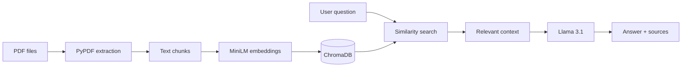

<div align="center">

# 📚 PDF Question Answering

### Your documents. Your questions. Grounded answers.

<p>
    
    
    
    
</p>

<p>
    <strong>📄 Upload multiple PDFs · 🔎 Search their content · 💬 Get cited answers</strong>
</p>

</div>

> Ask questions about one or many PDFs and get grounded answers with page-level sources.

A lightweight Retrieval-Augmented Generation (RAG) application built with Streamlit, LangChain, ChromaDB, and Hugging Face. Add your PDFs to the `data/` folder, index them once, and ask questions through a clean web interface.

## ✨ Features

- 📚 Supports multiple PDF documents in one knowledge base
- ✂️ Extracts and splits PDF text into searchable chunks
- 🧠 Uses local sentence-transformer embeddings
- 🎯 Retrieves the four most relevant chunks for each question
- 🤖 Generates answers with `meta-llama/Llama-3.1-8B-Instruct`
- 🔗 Displays the source PDF and page number for retrieved context
- 🔐 Keeps secrets and the vector database out of Git with `.gitignore`

## 🧩 How It Works



## 🗂️ Project Structure

```text
.
├── app.py        # Streamlit user interface
├── ingest.py     # PDF loading, chunking, and indexing
├── rag.py        # Retrieval and answer generation
├── data/         # Add PDF files here
└── .env          # Local Hugging Face token
```

## 🚀 Quick Start

### Prerequisites

- Python 3.10 or newer
- A Hugging Face access token with inference permissions

### 1. Clone the repository

### 2. Create and activate a virtual environment

Windows PowerShell:

```powershell
python -m venv .venv
.\.venv\Scripts\Activate.ps1
```

### 3. Install dependencies

```powershell
pip install streamlit langchain-chroma langchain-huggingface langchain-text-splitters pypdf python-dotenv sentence-transformers
```

### 4. Add your Hugging Face token 🔑

Create a `.env` file in the project root:

```env
HUGGINGFACEHUB_ACCESS_TOKEN=your_token_here
```

> ⚠️ Keep this token private. Never commit `.env`.

### 5. Add PDFs and build the index 📥

Place one or more PDF files in `data/`, then run:

```powershell
python ingest.py
```

Run ingestion again whenever you add or replace documents. Avoid repeatedly ingesting the same files without clearing the existing `chroma_db/` directory, because that can create duplicate entries.

### 6. Start the app 🌐

```powershell
streamlit run app.py
```

Open the local URL shown by Streamlit, usually `http://localhost:8501`.

## 💡 Example Questions

- 📝 What is the main idea of this document?
- 📝 Summarize the section about deployment.
- 📝 Which PDF discusses the data pipeline?
- 📝 On which page is the evaluation method described?

## 🛠️ Tech Stack

| Layer | Technology |
| --- | --- |
| Interface | Streamlit |
| Orchestration | LangChain |
| Embeddings | `sentence-transformers/all-MiniLM-L6-v2` |
| Vector store | ChromaDB |
| PDF parsing | pypdf |
| Language model | Hugging Face `meta-llama/Llama-3.1-8B-Instruct` |

## 📌 Notes

This project answers from retrieved PDF context and is instructed to say when the answer is not present in the indexed documents. Retrieval quality depends on the PDF text extraction, chunking settings, embedding model, and question wording.

## 🤝 Contributing

Ideas and improvements are welcome. Open an issue or submit a pull request with a clear description of the change.

## 📄 License

Add your preferred license before publishing this project publicly.
